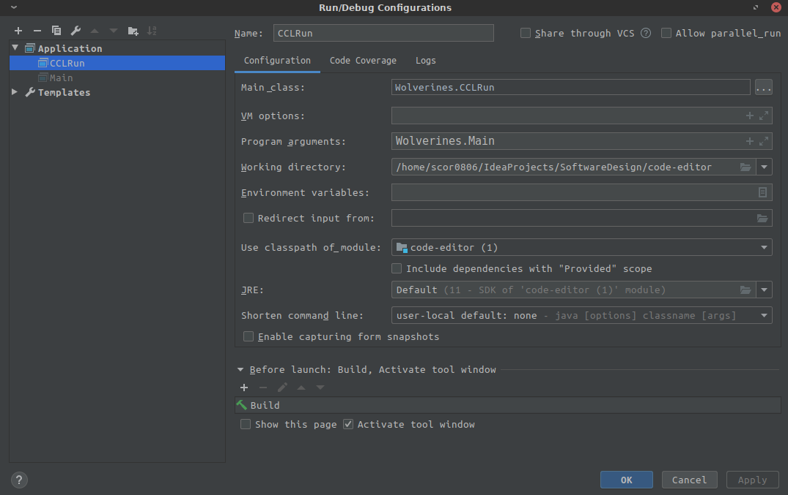

# COSC 4353 Group Project!

How to Use:

- Using Maven:
    - Use mvn compile to compile the source code
    
    ### Intellij IDE Example:
    
    
- Using ClassLoader:
    - Use CCLRun Wolverines.Main
    
    ### Intellij IDE Example:
    

